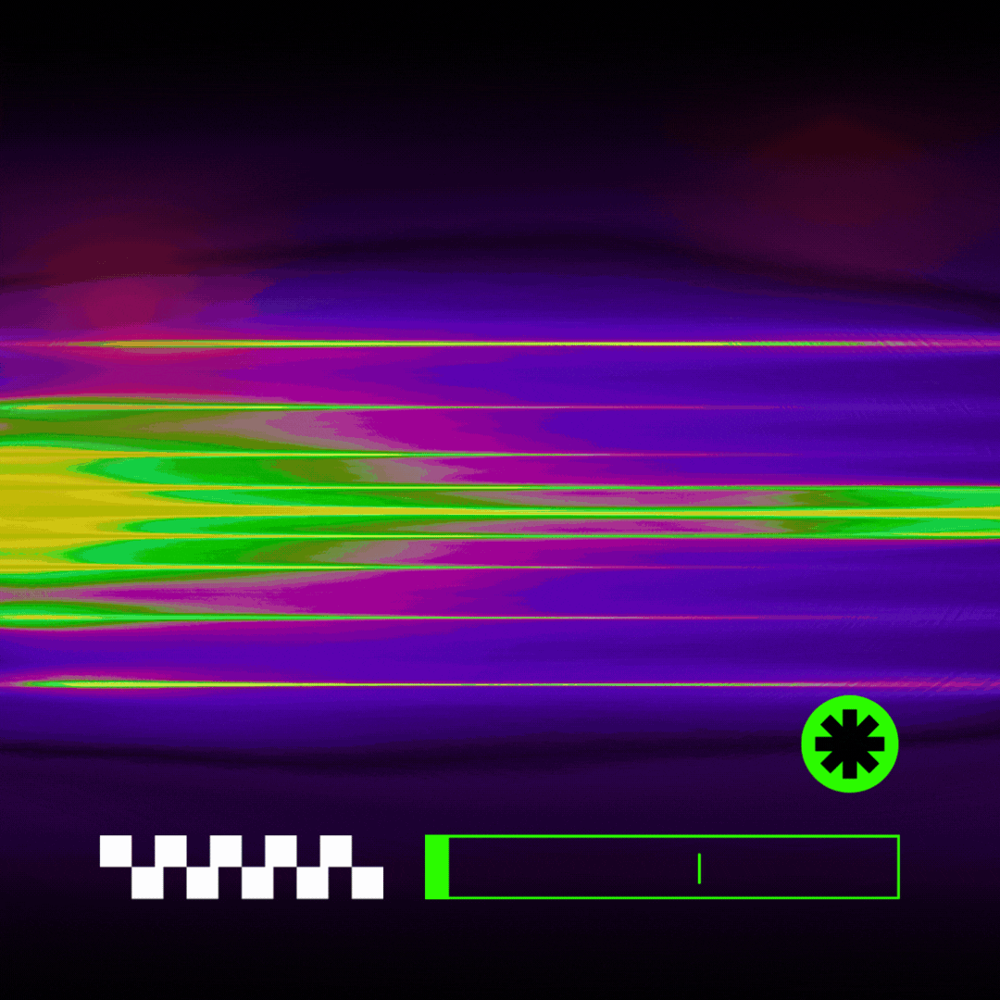
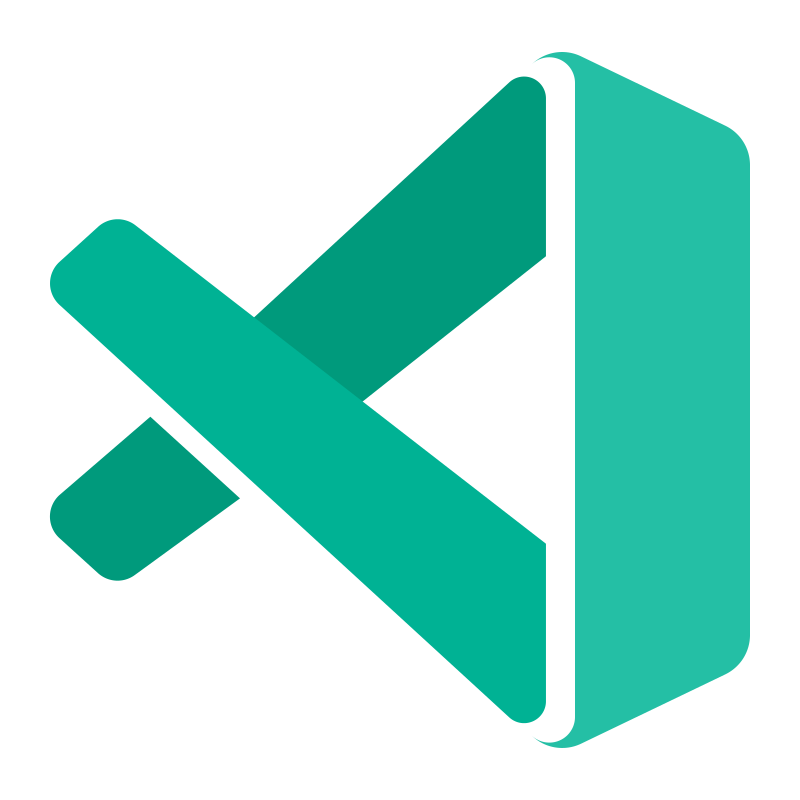

## Хола Чумба 👋, Я Эмир!

### 👽 BackEnd Developer | Web3 Hustler | LLM Researcher
Привет! Я Эмир, и я создаю **сайты 🌐, веб-приложения 📱, блокчейн решения 🛠️ и боты 🤖** с применением современных технологий. Мне нравится делать интересные проекты и совмещать различные нестандартные подходы в разработке.
 
 

  

### 💡 Стек технологий:
- **Blockchain:** Solidity для разработки смарт-контрактов, децентрализованных приложений (dApps) и Web3 интеграций.
- **Backend:** Python (Django, Flask, FastAPI), построение надёжных API, написание ботов для Telegram (Aiogram) и Discord, интеграция с внешними сервисами и базами данных (PostgreSQL, Redis).
- **Frontend:** Фреймворки React.js, Next.js - создание адаптивных интерфейсов и интерактивных компонентов.
- **DevOps:** Docker, настройка окружений для безопасного деплоя приложений, интеграция CI\CD, написание скриптов под Bash\Zsh.
- **AI & Data:** Python для обработки данных и создания автоматизированных решений, кастомизация и дообучение LLM.

 

### 🔨 Языки и инструменты в моем стеке:

 

 
 

 
 
 

 
 

### 🌱 Сейчас работаю над:
- Созданием автоматизаций для бизнеса через N8N (Low-Code).
- Написанием бэкенд-ситемы по созданию контент-завода для блогеров используя несколько API и нейросети (Python).
- Оркестрацией AI-агетов в единую безопасную сеть через ACP (Docker | OpenClaw).
- Развитием своей веб-лаборатории [Viper Labs](https://viperlabs.tech/).

### 🚀 Мой подход:
Каждый проект — это уникальная возможность привнести что-то новое. Я использую креативный взгляд вместе со структурностью, чтобы находить оригинальные решения сложных задач и пишу код, который не просто работает, а удивляет! (в хорошем смысле)

📫 &nbsp; Не бойтесь написать мне в [Telegram](https://www.t.me/strydex/) , я не кусаюсь (ну только если немного)

 

---
> #### Едят ли кошки мошек? Едят ли мошки кошек?
